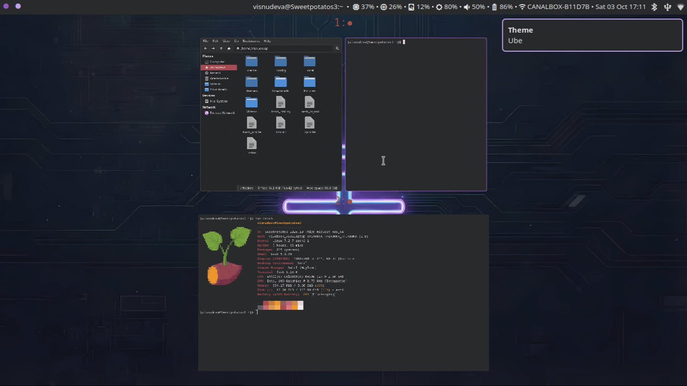
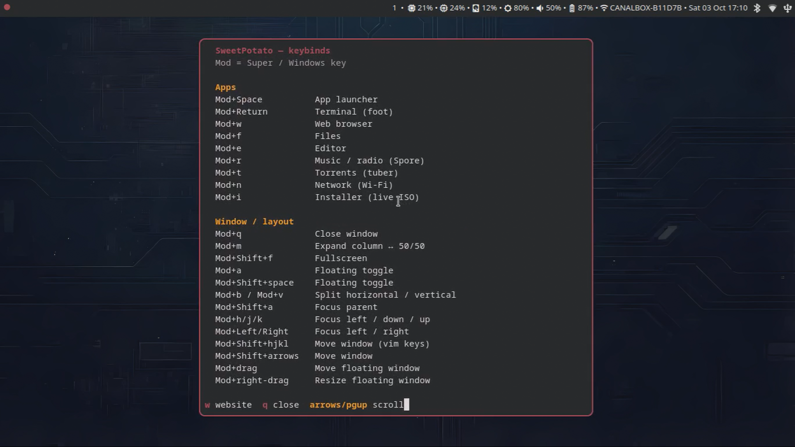
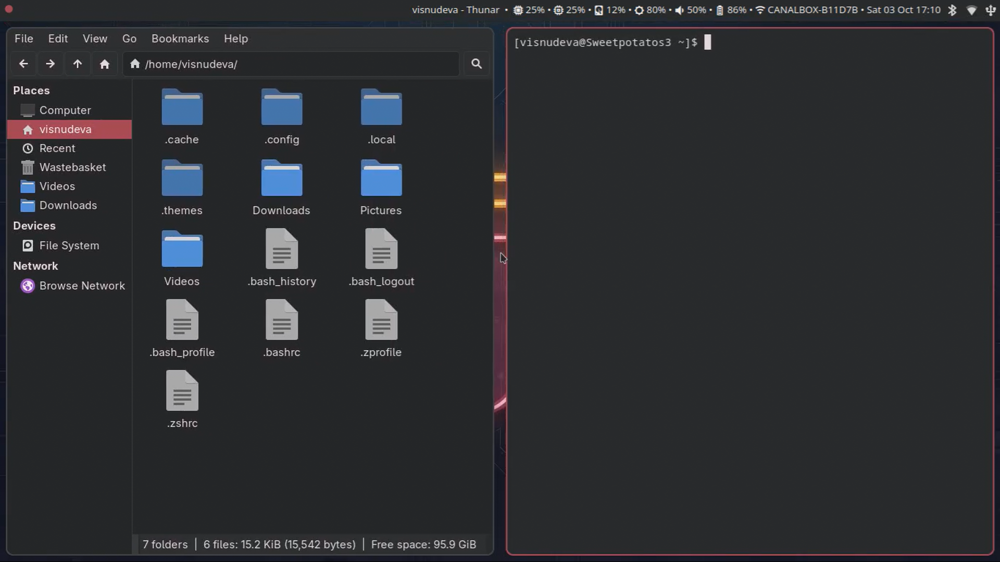
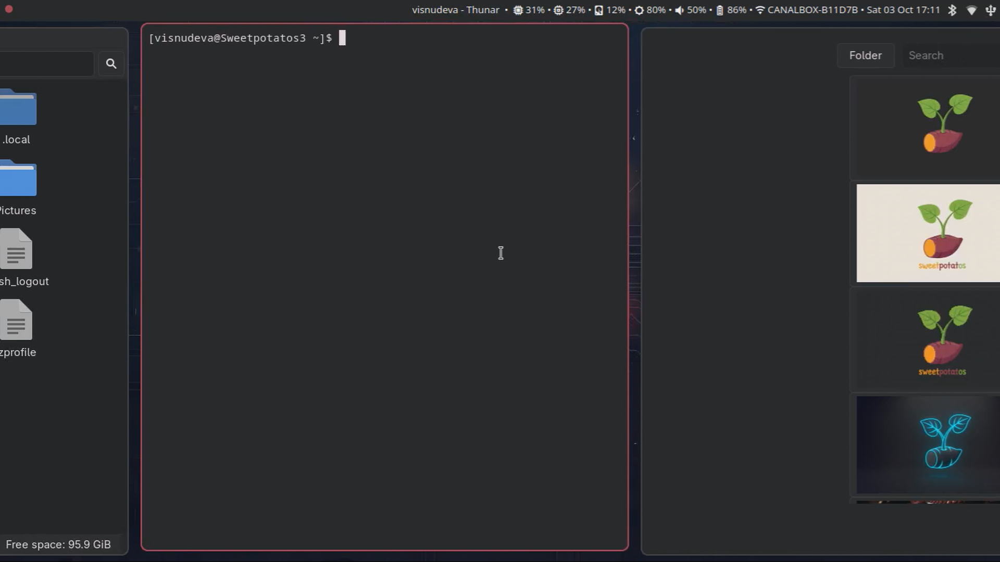

https://github.com/user-attachments/assets/e1b261fd-dcb4-4ee9-9f7c-58b1e2051926

# SweetPotato, bring the sweetness back to the potatoes

<table>
  <tr>
    <td align="center">
      <br>
      <sub>Desktop overview</sub>
    </td>
    <td align="center">
      <br>
      <sub>Keybinds</sub>
    </td>
  </tr>
  <tr>
    <td align="center">
      <br>
      <sub>Files and terminal</sub>
    </td>
    <td align="center">
      <br>
      <sub>Wallpaper picker</sub>
    </td>
  </tr>
</table>

<table>
  <tr>
    <td>
      <strong>A light Swirl arch-based setup and a theme to revive slow and old potatoes PCs
<br>
    </td>
    <td>
  
</td>
  </tr>
</table>

## Install

```bash
git clone https://github.com/visnudeva/SweetPotato.git
cd SweetPotato
chmod +x install.sh
./install.sh
```

Re-login once so close buttons and PATH fixes apply fully.

## Useful binds

| Bind | Action |
|------|--------|
| `Mod+n` | Wi‑Fi / NetworkManager |
| `Mod+Space` | App launcher |
| `Mod+w` | Web browser (Brave Origin) |
| `Mod+f` | file manager (thunar) |
| `Mod+e` | IDE (geany) |
| `Mod+r` | Music / radio (Spore) |
| `Mod+t` | Torrents (tuber) |
| `Mod+Return` | Terminal (foot) |
| `Mod+m` | Expand focused column to 100% / restore 50/50 |
| `Mod+a` | Floating toggle |
| `Mod+Shift+f` | Fullscreen |
| `Mod+?` | Floating keybind cheatsheet (toggle) |
| `Mod+Ctrl+w` | Wallpaper selector (waypaper) |
| `Mod+Shift+r` | Resize mode (arrow keys; Enter/Esc to exit) |
| `Print` | Screenshot → `~/Pictures/Screenshots` (+ clipboard) |
| `Mod+Shift+Print` | Region screenshot |
| `Mod+Print` | Screen record toggle (region + audio → `~/Videos`) |
| `Mod+q` / `Esc` | Kill focused window |
| `Mod+number` | Change workspaces |
| `Mod+Tab` | Workspace overview (Super+drag windows between desktops) |
| `Mod+Shift+Tab` | Overview of windows on the current desktop |
| Click (in overview) | Zoom back in on that window / desktop |
| `Mod+Up` / `Mod+Down` | Workspace above / below (also exits overview) |
| `Mod+Left` / `Mod+Right` / `Mod+hjkl` | Focus window visually |
| `Mod+Ctrl+Up` / `Mod+Ctrl+Down` | Move window to workspace above / below |
| `Mod+Shift+number` | Move window to workspace 1–10 |
| `Mod+l` | Lock screen |
| `Mod+c` | Caffeine toggle (no sleep / idle lock) |
| `Mod+Shift+e` | Exit Swirl |
| `Mod+o` / `Mod+Escape` | Power off |
| `Mod+Shift+c` | Reload config |

`Mod` is usually the Super/Windows key. After each login, a notification points at `Mod+?` for the floating cheatsheet.

## Default apps

| Role | App |
|------|-----|
| Browser | Brave Origin |
| Files | Thunar |
| Editor | Geany |
| Calculator | galculator |
| Terminal | foot |
| Video | mpv + yt-dlp |
| Image edit | GIMP |
| Music / radio | Spore |
| Nearby share | LocalSend |
| PDF | mupdf |
| Images | swayimg |
| Torrents | tuber |
| Webcam | guvcview |
| Color picker | hyprpicker |
| Packages | Shelly (+ yay / AUR) |
| Disks | GNOME Disks |

## What’s included

- User overrides: `~/.config/swirl/config.d/user` (seeded once; never overwritten by updates)
- Status bar / IPC / nag via system tools (`swaybar`, `swaymsg`, `swaynag`)
- Charcoal GTK accents over Adwaita-dark
- Screen lock, foot terminal, mako, Geany color scheme
- Wi‑Fi menu via `networkmanager-dmenu` (`Mod+n`)
- Polkit udisks rules so Disks can write ISOs to USB on Swirl
- Firefox Save As fix (`xdg-desktop-portal-gtk` PATH)
- Glycin SVG loader tweak for Papirus on low-RAM machines

### Gestures

| Gesture | Action |
|---------|--------|
| 3-finger left / right | Scroll the window strip |
| 4-finger up / down | Next / previous workspace |
